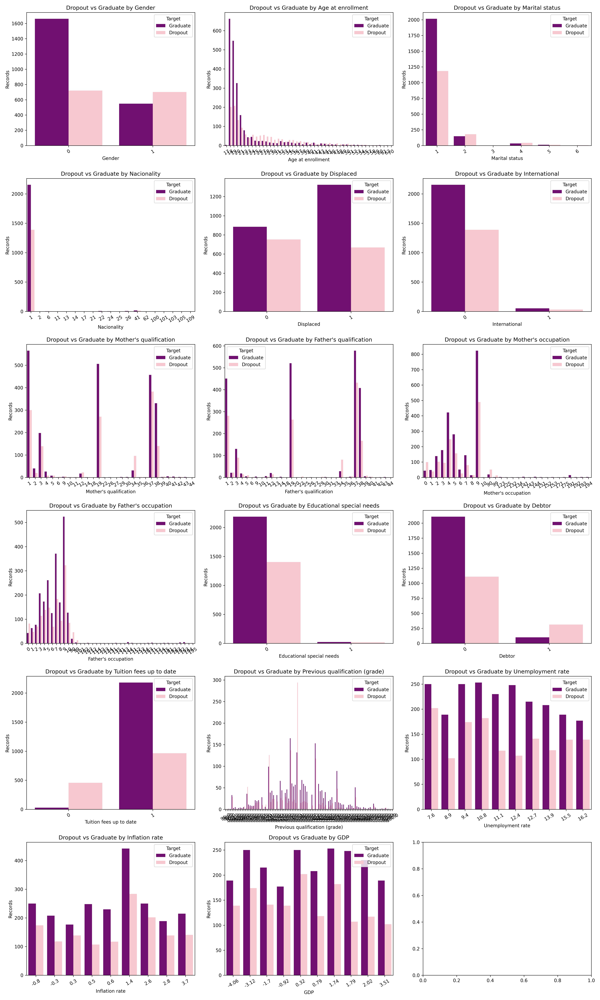

# Making Fair Predictive Models - Mitigating Bias

## Problem Statement  

Predictive models in education can help identify students at risk of dropping out, enabling timely interventions. However, such models often inherit or amplify biases from real-world data, leading to unfair outcomes across demographic groups.  

This project uses the **UCI “Predict Students’ Dropout and Academic Success” dataset** to build classification models that not only predict student outcomes (**Dropout, Enrolled, Graduate**) with high accuracy but also address **fairness** concerns.  

### Objectives  
- **Bias Identification**: Detect potential sources of unfairness in the dataset.  
- **Model Development**: Train classifiers (e.g., XGBoost, Random Forest) to predict outcomes.  
- **Fairness Evaluation**: Assess performance across demographic groups using fairness metrics.  
- **Bias Mitigation**: Apply strategies like feature elimination, reweighting, and calibration.  
- **Ethical Reflection**: Discuss trade-offs between accuracy and fairness in real-world impact.  

The goal is to create models that are not only **accurate** but also **equitable**, supporting fair decision-making in education.  

## Dataset Attributes

| S. No. | Attribute Name                               | Role    | Type       | Description                         | Missing Values |
|--------|----------------------------------------------|---------|------------|-------------------------------------|----------------|
| 1      | Marital status                               | Feature | Integer    | Demographic                          | None           |
| 2      | Nationality                                  | Feature | Integer    | Demographic                          | None           |
| 3      | Displaced                                    | Feature | Integer    | Demographic                          | None           |
| 4      | Gender                                       | Feature | Integer    | Demographic                          | None           |
| 5      | Age at enrollment                            | Feature | Integer    | Demographic                          | None           |
| 6      | International                                | Feature | Integer    | Demographic                          | None           |
| 7      | Application mode                             | Feature | Integer    | Academic data at enrollment          | None           |
| 8      | Application order                            | Feature | Integer    | Academic data at enrollment          | None           |
| 9      | Course                                       | Feature | Integer    | Academic data at enrollment          | None           |
| 10     | Daytime/evening attendance                   | Feature | Integer    | Academic data at enrollment          | None           |
| 11     | Previous qualification                        | Feature | Integer    | Academic data at enrollment          | None           |
| 12     | Previous qualification (grade)               | Feature | Continuous | Academic data at enrollment          | None           |
| 13     | Admission grade                              | Feature | Continuous | Academic data at enrollment          | None           |
| 14     | Mother’s qualification                        | Feature | Integer    | Socioeconomic                        | None           |
| 15     | Father’s qualification                        | Feature | Integer    | Socioeconomic                        | None           |
| 16     | Mother’s occupation                           | Feature | Integer    | Socioeconomic                        | None           |
| 17     | Father’s occupation                           | Feature | Integer    | Socioeconomic                        | None           |
| 18     | Educational special needs                     | Feature | Integer    | Socioeconomic                        | None           |
| 19     | Debtor                                       | Feature | Integer    | Socioeconomic                        | None           |
| 20     | Tuition fees up to date                       | Feature | Integer    | Socioeconomic                        | None           |
| 21     | Scholarship holder                            | Feature | Integer    | Socioeconomic                        | None           |
| 22     | Curricular units 1st sem (credited)          | Feature | Integer    | Academic data at end of semester 1   | None           |
| 23     | Curricular units 1st sem (enrolled)          | Feature | Integer    | Academic data at end of semester 1   | None           |
| 24     | Curricular units 1st sem (evaluation)        | Feature | Integer    | Academic data at end of semester 1   | None           |
| 25     | Curricular units 1st sem (approved)          | Feature | Integer    | Academic data at end of semester 1   | None           |
| 26     | Curricular units 1st sem (grade)             | Feature | Integer    | Academic data at end of semester 1   | None           |
| 27     | Curricular units 1st sem (without evaluations) | Feature | Integer  | Academic data at end of semester 1   | None           |
| 28     | Curricular units 2nd sem (credited)          | Feature | Integer    | Academic data at end of semester 2   | None           |
| 29     | Curricular units 2nd sem (enrolled)          | Feature | Integer    | Academic data at end of semester 2   | None           |
| 30     | Curricular units 2nd sem (evaluation)        | Feature | Integer    | Academic data at end of semester 2   | None           |
| 31     | Curricular units 2nd sem (approved)          | Feature | Integer    | Academic data at end of semester 2   | None           |
| 32     | Curricular units 2nd sem (grade)             | Feature | Integer    | Academic data at end of semester 2   | None           |
| 33     | Curricular units 2nd sem (without evaluations) | Feature | Integer  | Academic data at end of semester 2   | None           |
| 34     | Unemployment rate                             | Feature | Continuous | Macroeconomic                        | None           |
| 35     | Inflation rate                                | Feature | Continuous | Macroeconomic                        | None           |
| 36     | GDP                                           | Feature | Continuous | Macroeconomic                        | None           |
| 37     | Target                                       | Target  | Categorical| —                                     | None           |

## Potential Bias in Dataset Features
So for evaluating only Academic Sucess, Dropout these features can include bias in a way as given in table
### 1. Demographic Features
| Feature | Potential Bias Type | Explanation |
|---------|-------------------|-------------|
| Gender | Gender bias | Model may favor one gender over another in predicting Dropout/Graduation. |
| Age at enrollment | Age bias | Older or younger students might be treated differently. |
| Marital status | Social bias | Married/unmarried students could be unfairly predicted to drop out. |
| Nationality | Ethnic / nationality bias | Predictions may favor local vs. international students. |
| Displaced | Socioeconomic bias | Displaced students may have systemic disadvantages. |
| International | Cultural / regional bias | International students might have different educational patterns affecting predictions. |

### 2. Socioeconomic Features
| Feature | Potential Bias Type | Explanation |
|---------|-------------------|-------------|
| Mother’s qualification | Socioeconomic bias | May favor students with highly educated parents. |
| Father’s qualification | Socioeconomic bias | Same as above. |
| Mother’s occupation | Socioeconomic bias | Students from higher occupational classes may be predicted more positively. |
| Father’s occupation | Socioeconomic bias | Same as above. |
| Educational special needs | Ability bias | Students with special needs may be unfairly predicted as likely to drop out. |
| Debtor | Socioeconomic bias | May disadvantage students with unpaid debts. |
| Tuition fees up to date | Socioeconomic bias | Could reflect wealth, affecting model predictions. |

### 3. Academic Features
| Feature | Potential Bias Type | Explanation |
|---------|-------------------|-------------|
| Previous qualification / grade | Academic performance bias | Could favor students from certain schools or educational systems. |

### 4. Macroeconomic Features
| Feature | Potential Bias Type | Explanation |
|---------|-------------------|-------------|
| Unemployment rate | Regional / economic bias | Students from regions affected by unemployment may be unfairly predicted as higher risk. |
| Inflation rate | Regional / economic bias | Regional economic conditions could bias predictions. |
| GDP | Regional / economic bias | Students from low-GDP regions may face systemic disadvantage. |

Rest of the features are Academics related and is unlikely to include any non Academics biases

## Bias Analysis Graphs

Here is the distribution of **Dropout vs Graduate** across bias-sensitive features:

